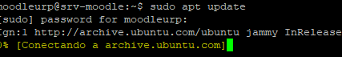
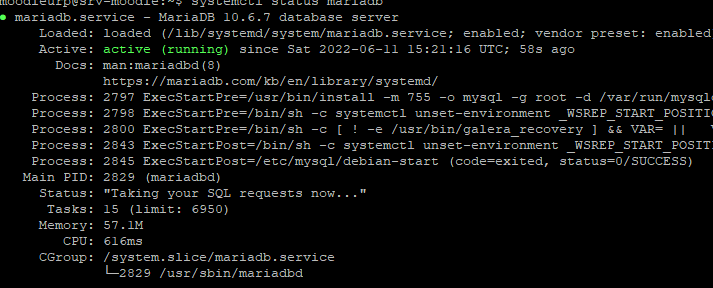
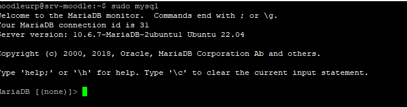
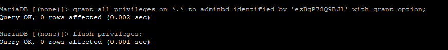
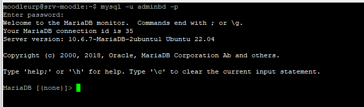
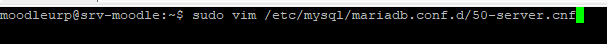
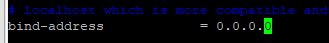
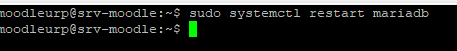
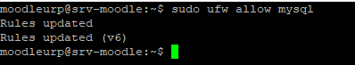

# Instalando MariaDB en Ubuntu 22.04 LTS

**Vamos a Instalar MaríaDB En Ubuntu 22.04 LTS** para esto hacemos la actualización de los paquetes del sistema.

    sudo apt update

Ahora procedemos a instalar los paquetes para la instalación de maríadb.

    sudo apt install -y mariadb-server

Comprobamos el estado del servicio mediante el siguiente comando.

    systemctl status mariadb

Procedemos a colocar contraseña al usuario root de MariaDB. 
Ingresamos a la consola de mariaDB con el comando:

    sudo mysql

Generamos una contraseña para el usuario root de mariadb con el siguiente comando:

    alter user root@localhost identified by 'usuario';

Actualizamos los permisos en la tabla

    flush privileges;

Cerramos sesión

    exit;

**Crear un usuario administrador**

Es importante disponer de un usuario administrador propio que pueda ser usado en aplicaciones de gestión, conexiones remotas etc.
Ingresamos a la consola de mariadb

    mysql  -u root -p 

Luego:

    grant all privileges on *.* to adminbd identified by 'usuario' with grant option;

Posteriormente:

    flush privileges;

De regreso a línea de comando para conectar al servicio con el nuevo usuario habrá que utilizar los parámetros -u y -p:

Por defecto el acceso remoto no permite conexiones remotas en Ubuntu 22.04 LTS . Para cambiar esta configuración tenemos que realizar lo siguiente.
Comando:

    sudo vim /etc/mysql/mariadb.conf.d/50-server.cnf

Buscamos la directiva bind-address y cambiamos por 0.0.0.0

Procedemos a reiniciar el servicio para aplicar la nueva configuración.

Ahora aplicaremos una regla al firewall para permitir conexiones entrantes al servidor de Base de datos.

