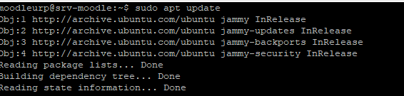
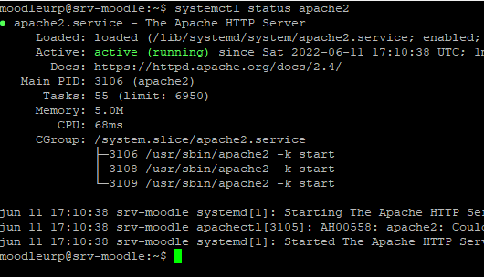
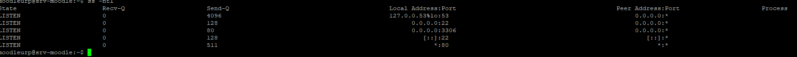
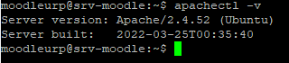
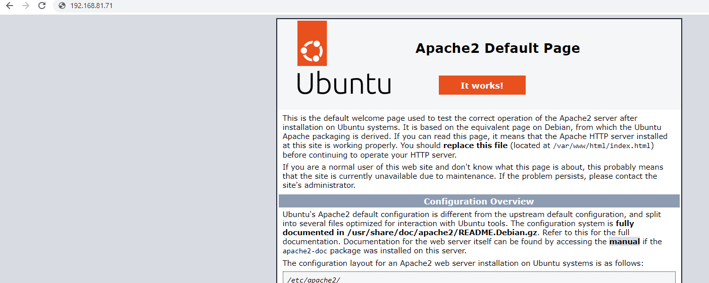

# Instalando Apache Web Server

Vamos a instalar el servidor web apache en Ubuntu 22.04 LTS jammy Jellyfish desde los repositorios de la propia distribución, por lo que actualizamos.

    sudo apt update

    sudo apt install apache2

Comprobamos el estado del servicio:

El servicio queda escuchando peticiones para el protocolo http en el puerto 80 TCP, como podemos comprobar por comandos.

Comando para saber la versión del servidor apache.

Configuramos los permisos en el firewall para el servidor apache.

==Para http==

    sudo ufw allow http

==Para https==

    sudo ufw allow https

Probamos la configuración desde un navegador.

