# Moodle sobre Ubuntu

Descargamos Moodle de la siguiente manera: **wget** [Enlace](https://download.moodle.org/download.php/direct/stable400/moodle-latest-400.tgz)

Para poder **instalar Moodle en Ubuntu 22.04 LTS Jammy Jellyfish** será necesario realizar una serie de pasos antes de poder lanzar el instalador web. Vamos a ver a continuación dichos pasos, así como la instalación vía web y algún trabajo de post-instalación.

### **Archivos de Moodle**

Descomprimimos el paquete que acabamos de descargar directamente en la ubicación final de la plataforma:

    sudo tar xf moodle-latest-400.tgz -C /var/www/html/

Creamos el directorio de datos de Moodle fuera de los directorios navegables:

    sudo mkdir /var/www/moodledata

Como Moodle necesita escribir en ambos directorios a través del servicio web, cambiamos la propiedad de estos directorios al usuario con el que corre dicho servicio en Ubuntu 22.04 LTS:

    sudo chown www-data: /var/www/{moodledata,html/moodle}

### **Base de Datos**

Moodle trabaja sobre una base de datos que debemos crear y configurar antes de la instalación, siendo soportados varios de los motores de bases de datos más usados en Ubuntu 22.04 LTS.

### **MARIADB/MYSQL**

Conectamos al servicio con el cliente de consola y un usuario administrador:

    mysql -u root -p

Creamos la base de datos:

    create database moodle character set utf8mb4 collate utf8mb4_unicode_ci;

Creamos el usuario con su contraseña:

     grant all privileges on moodle.* to moodle@localhost;

Luego:

     exit

### **PHP**

Moodle requiere la presencia en Ubuntu 22.04 LTS de ciertas extensiones de este lenguaje de programación que instalaremos, teniendo en cuenta la versión presente en el sistema, con apt; por ejemplo, para la versión 7.4:

    sudo apt install -y php7.4-{curl,gd,intl,mbstring,soap,xml,xmlrpc,zip}

También debemos realizar algún ajuste de configuración en el archivo php.ini, así que lo editamos:

    sudo vim /etc/php/7.4/apache2/php.ini

La activaremos eliminando el carácter ; al inicio de línea y modificamos su valor al mínimo recomendado:

    max_input_vars = 5000

Guardamos el archivo y recargamos la configuración del servicio para aplicar todos estos cambios:

    sudo systemctl reload apache2

### **Instalador web**

Para **acceder al instalador web de Moodle en Ubuntu 22.04 LTS desde un navegador** formaremos una URL con la dirección del servidor (IP, dominio, nombre DNS, etc.) añadiendo la ruta de instalación dentro de la estructura de archivos web (==/moodle en este tutorial==).

Por ejemplo, la máquina Ubuntu 22.04 LTS Jammy Jellyfish sobre la que hemos preparado este tutorial es accesible en el subdominio ubuntu2204.local.lan, por lo que usaremos [http://ubuntu2204.local.lan/moodle](http://ubuntu2204.local.lan/moodle) como URL:

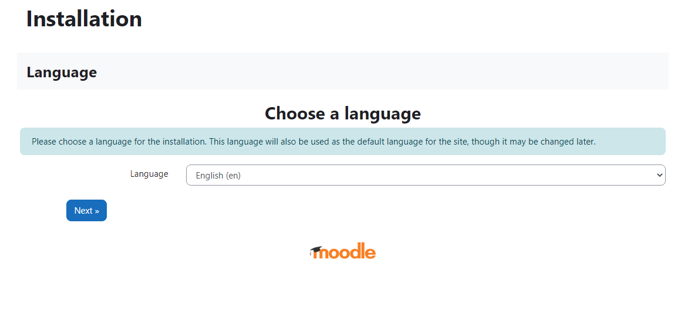

Seguidamente configuramos la conexión al servicio de bases de datos que hemos elegido:

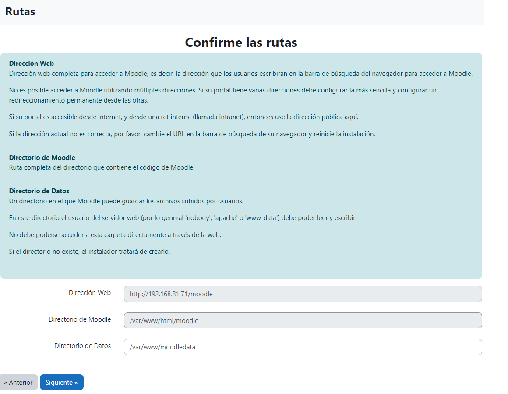

Seguidamente configuramos la conexión al servicio de bases de datos que hemos elegido:

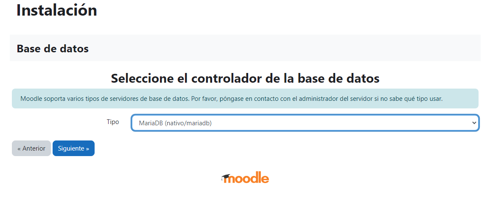
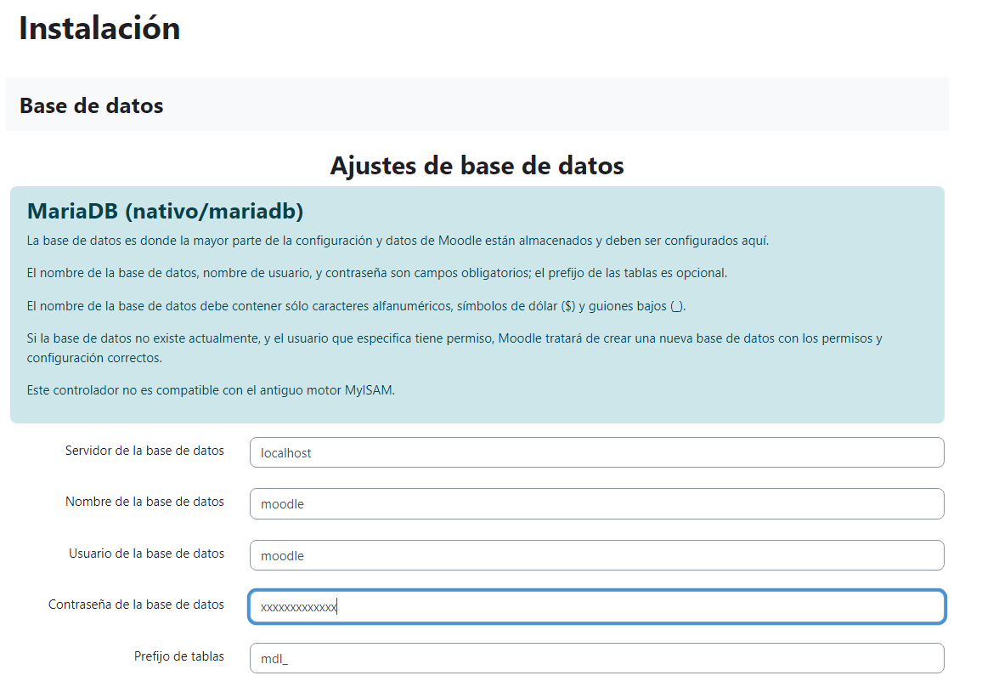
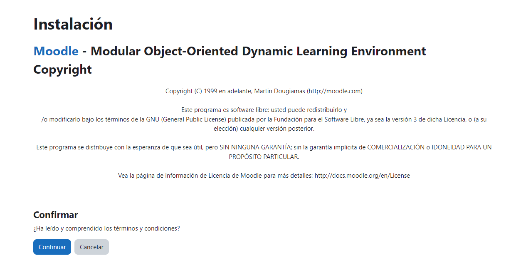

Clic en continuar

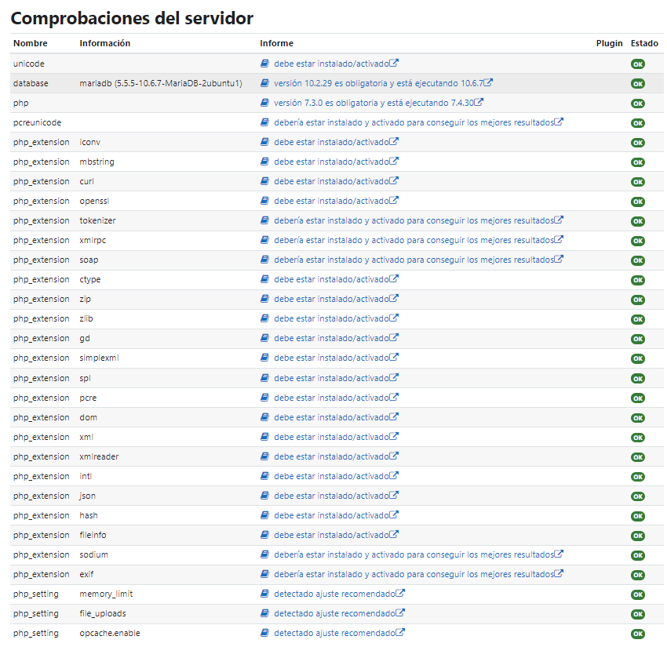
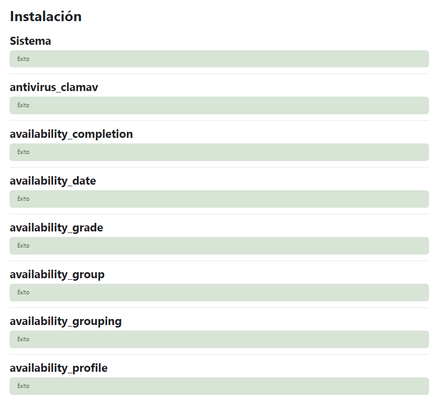

Ahora configuramos el usuario administrador.

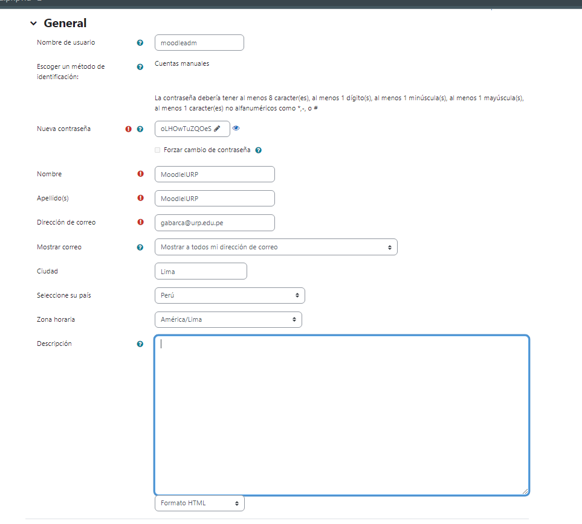

Igualmente, en la siguiente sección añadiremos información de identificación del nuevo sitio Moodle:

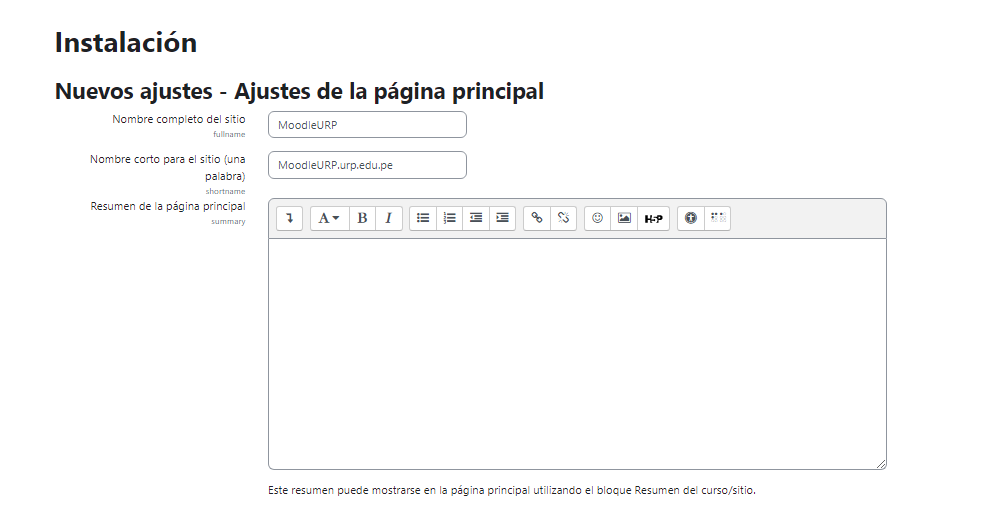
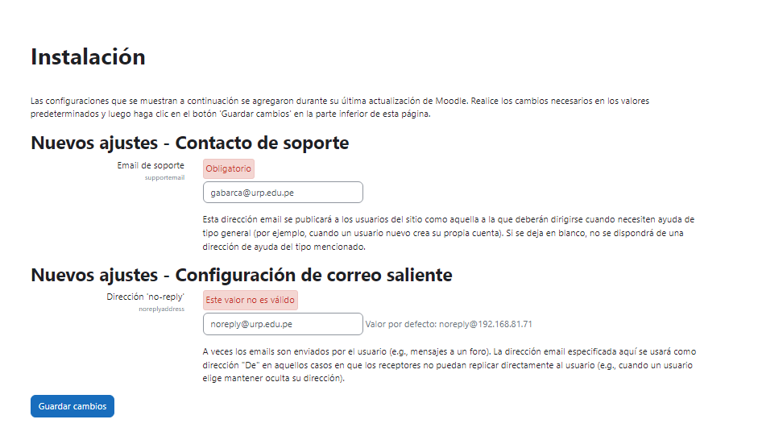
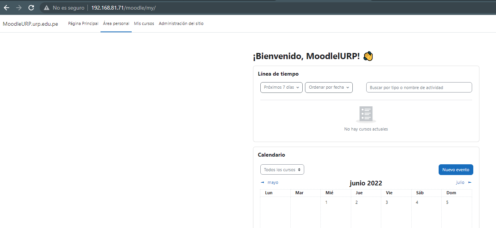

### **Post Instalación**

Moodle requiere la creación de una tarea programada del servicio Cron de Ubuntu 22.04 LTS para el mantenimiento en segundo plano de la aplicación.
Creamos el archivo de configuración de la tarea:

    sudo vim /etc/cron.d/moodle

Con la siguiente línea como contenido:

    */1 * * * * www-data /usr/bin/php /var/www/html/moodle/admin/cli/cron.php

Una vez guardado este archivo la tarea programada se lanzará regularmente en el intervalo especificado, que en este caso es de 1 minuto. Tal vez te parezca poco tiempo, pero es lo que requiere Moodle.